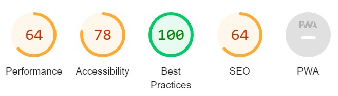

# Lab-03

## Progress

- I completed all tasks, but I don't really understand where the five quiz questions are supposed to fit - why am I asking the user to guess so many things?
- So I couldn't put all the quiz answers into arrays to re-factorise - it would mean redesigning the entire page to add these questions - but I do know how to do it, and I used this for the last question - "Guess my birth month" - by having the different versions of January the user might input in a list to check against. Same thing could be more easily achieved by cleaning the data - changing to lower case would work.
- I used a random number for the guess the number game (stretch goals) - so the user can play it multiple times, and I printed the guesses used onto the page - needs a little tweak to get the first guess in. Biggest issue for me there is I'd like it to add to the page with each guess, but it stacks those tasks until it's exited the loop (research has not yielded a solution to this yet, but lots of info about messages and stacks and queues).
- I spent a lot of time on the formatting and I am quite pleased with it. I would liek to have been able to have some equally spaced and widthed bars of colour instead of the gradient, but I could only use it to make one, so I had to make do with having a corner in solid colour.
- Accessibility score was high straight away - I assume I don't have to do things to make it worse to get within the given range. It doesn't much like the colour contrasts, but I think they are mostly good - buttons could change, and have hover over effects.  
  

// Stretch Goals
// After completing all of the requirements listed above, you may optionally challenge yourself further
// by implementing some or all of the following into your application.

// 1️⃣ Attempt to make your code more DRY by putting all of the questions, answers, and responses
// to the first five yes/no questions into arrays (or even one huge multidimensional array),
// and modifying the game logic such that a ‘for’ loop will control the flow from question to question.
// 2️⃣ Make the number-guessing question use a random number as its correct answer.
